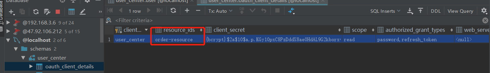

#### 一.配置资源管理时


```java
public class OAuth2ResourceServer extends ResourceServerConfigurerAdapter {

    private final static String RESOURCE_ID="order-resource";
    @Override
    public void configure(HttpSecurity http) throws Exception {
        http.authorizeRequests()
                .antMatchers("/**").permitAll();
    }

    @Override
    public void configure(ResourceServerSecurityConfigurer resources) throws Exception {
        //如没有此配置则会报下面这个错误
        resources.resourceId(RESOURCE_ID);
    }
```



```json
{
    "error": "access_denied",
    "error_description": "Invalid token does not contain resource id (oauth2-resource)"
}
```

